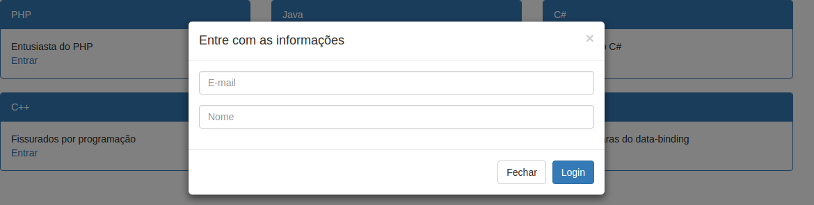
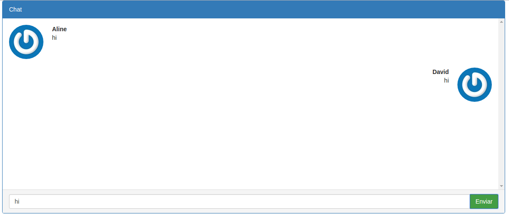

# Chat Firebase, Vuejs and webpack #

Create file "firebase-config.js" in folder app.
Example : app/firebase-config.js
put this code in file:

````
import Firebase from 'firebase';

var firebaseApp = Firebase.initializeApp({
        apiKey: "YOUR-API-KEY",
        authDomain: "AUTH-DOMAIN",
        databaseURL: "URL-DATABASE",
        storageBucket: "STORAGE",
});
export default firebaseApp.database();
````

run in terminal
````
npm install
````

after install run server
````
webpack-dev-server --progress --inline --hot
````

# Rooms http://localhost:8080/#!/rooms



# Chat http://localhost:8080/#!/chat/003

